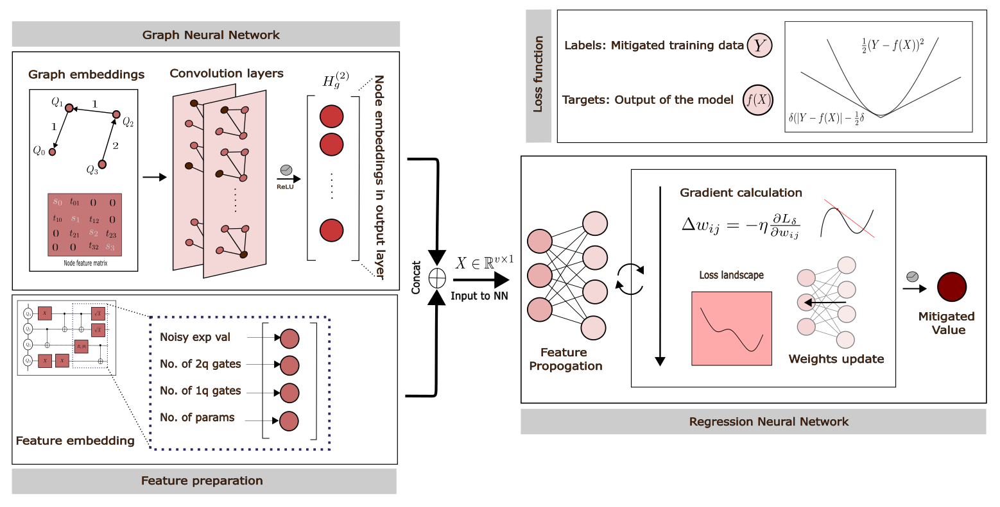
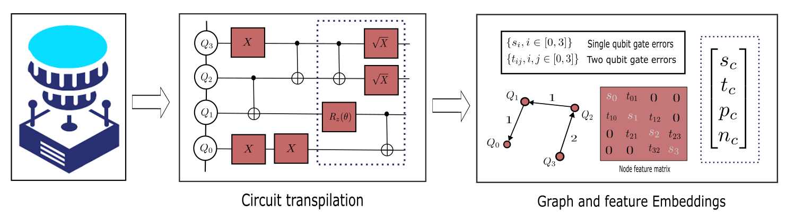

# Machine Learning Approach towards Quantum Error Mitigation for Accurate Molecular Energetics.

This repository contains a code for implementing the GNN-Regressor EM technique. The code is written in Python 3.8.10.

## Overview

<div align="center">
    
</div>

Despite significant efforts, the realization of the variational quantum eigensolvers has predominantly been confined to proof-of-principles, mainly due to the hardware noise. With fault-tolerant implementation being a long-term goal, going beyond small molecules with existing Error Mitigation (EM) techniques with current NISQ devices has been a challenge.  That being said, statistical learning methods are promising approaches to learning the noise and its subsequent mitigation. We devise a graph neural network and regression-based architecture to go beyond the mitigation of 2-electron Hamiltonians. As current qubits are prone to decoherence, ML models should be able to learn features quickly with shallow circuits. We assume that we do not have access to the fault-tolerant qubits and use Sequential Reference State Error Mitigation (SREM) which works seamlessly for shallow-depth circuits. We use these mitigated expectation values obtained as labels in the training data thus eliminating the need for ideal quantum simulators in label generation. The training data is generated on-the-fly during ansatz construction thus removing the computational overhead. Building upon that, We test our method on larger Hamiltonian structures like H4 and BH which yields promising results in determining ground state. 

<div align="center">
    
</div>

# Cloning and handling dependencies 
Clone the repo:
```
 git clone https://github.com/Next-di-mension/GraphNetMitigator.git
```
### Install the dependencies:
```
pip install -r requirements.txt
```
### Repository structure
```
.
├── config
│   ├── gnn_config.py
│   ├── h4.py
├── src
│   ├── gate_errors.py
│   ├── geometry_params.py
│   ├── graphnet_regressor.py
│   ├── test_data_generation.py
│   ├── train_data_generation.py
|   ├── workflow.py
├── LICENSE
├── .gitignore
├── requirements.txt
├── README.md

```

## Running the code
The code is divided into two main parts:
1. Data Generation
2. Model Training and Testing

### Data Generation
To generate training data, run `train_data_generation.py` by using the appropriate configuration file depending upon the molecule. For example, to generate training data for the H4 molecule, run:
```python
python src/train_data_generation.py --config config/h4.py
```
This will generate the training data and save it in the `data` directory. Generate the test data similarly using `test_data_generation.py` script. 

### Demo Data
We generate data in two settings; one with the ideal labels and one with the labels generated by using SREM technique. Here is the small snippet of how the data looks like

| Operator | Noisy expectation | Ideal expectation | SREM expectation | Two qubit gates  | Single qubit gates | Singles | Doubles | Parameters |
|----------|----------|----------|----------|----------|----------|----------|----------|----------|
| ((1, 6), (2, 7)) | -24.5909392 | -24.62052992 | -24.61193338 | 0.333333333 | 0.6666666670 | 0.083333333 | 0.0625 | [(13, 12), (10, 12), (12, 10), (10, 12), (12, 15), (12, 13), (15, 12), (10, 12), (15, 12), (13, 12), (15, 12), (10, 12), (15, 12), (13, 12), (12, 13), (12, 15), (10, 12), (12, 10), (10, 12), (13, 12)]|


### Model Training and Testing
To train and test the model, run `graphnet_regressor.py` script. For example, to train and test the model for H4 or BH molecule, run:
```python
python src/graphnet_regressor.py --config config/gnn_config.py
```
with appropriate config parameters depending upon the quantum device used. The specifications of the quantum device like gate errors are included in `gate_errors.py` file. Other parametrs related to geometry of the molecule and corresponding ansatz used are in `geometry_params.py` file.


### Workflow
To run the whole software, run `workflow.py` script:
```python   
python src/workflow.py --config config/gnn_config.py
```

## Results
We tested our model on two quantum devices. IBMQ Melbourne and IBMQ Guadalupe with 15 and 16 qubits respectively for H4 and BH molecules. The results are shown below:


