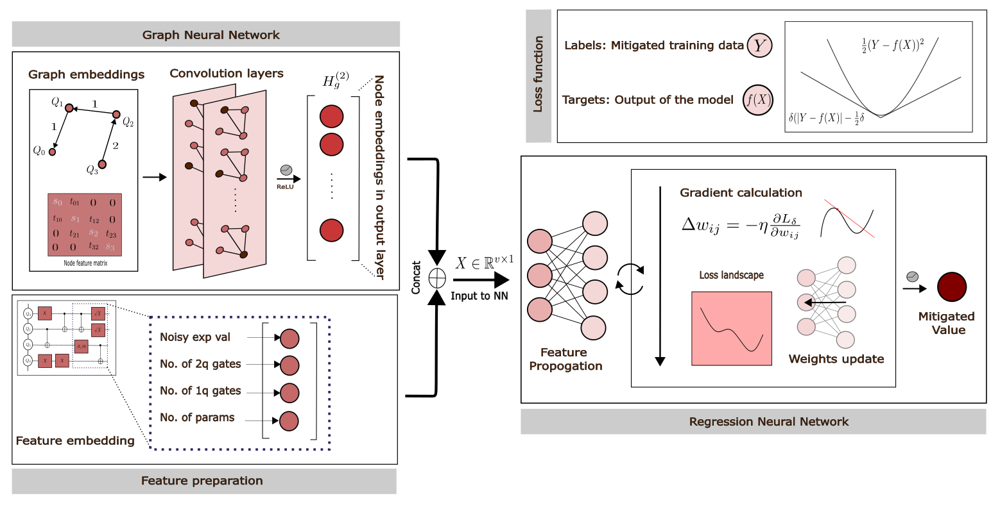
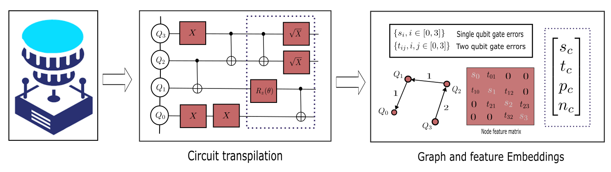

# Machine Learning Approach towards Quantum Error Mitigation for Accurate Molecular Energetics.


[](https://arxiv.org/abs/2504.07077)


This repository contains code for implementing the algorithms developed in the paper: 

S. Patil, D. Mondal, R. Maitra [Machine Learning Approach towards Quantum Error Mitigation for Accurate Molecular Energetics,](https://arxiv.org/abs/2504.07077) arxiv (2025).

## Overview

<div align="center">
    
</div>

Despite significant efforts, the realization of the variational quantum eigensolvers has predominantly been confined to proof-of-principle, mainly due to the hardware noise. With fault-tolerant implementation being a long-term goal, going beyond small molecules with existing Error Mitigation (EM) techniques with current NISQ devices has been challenging.  That being said, statistical learning methods are promising approaches to learning the noise and its subsequent mitigation. We devise a graph neural network and regression-based architecture to go beyond the mitigation of 2-electron Hamiltonians. As current qubits are prone to decoherence, ML models should be able to learn features quickly with shallow circuits. We assume that we do not have access to the fault-tolerant qubits and use Sequential Reference State Error Mitigation (SREM), which works seamlessly for shallow-depth circuits. We use these mitigated expectation values obtained as labels in the training data, thus eliminating the need for ideal quantum simulators in label generation. The training data is generated on-the-fly during ansatz construction thus removing the computational overhead. Building upon that, we test our method on larger Hamiltonian structures like H4 and BH, which yields promising results in determining the ground state. 

<div align="center">
    
</div>

# Cloning and handling dependencies 
Clone the repo:
```
 git clone https://github.com/Next-di-mension/GraphNetErrorMitigator.git
```
### Install the dependencies:
```
pip install -r requirements.txt
```
### Repository structure
```
.
├── config
│   ├── gnn_config.yml
│   ├── molecule.yml
├── res
├── src
│   ├── gate_errors.py
│   ├── geometry_params.py
│   ├── train.py
│   ├── test_data_generation.py
│   ├── training_data_generation.py
│   ├── training_data_generation_zne.py
|   ├── workflow.py
├── LICENSE
├── .gitignore
├── requirements.txt
├── README.md

```

## Running the code
The code is divided into two main parts:
1. Data Generation
2. Model Training and Testing

### Data Generation
To generate training data, run `training_data_generation.py` using the appropriate parameters in the configuration file depending on the molecule. For example, to generate training data for the H4 molecule, run:
```python
python src/training_data_generation.py --config config/molecule.yml
```
This will generate and save the training data in the `data` directory. Generate the test data similarly using the `test_data_generation.py` script. Note that in the test data, the column `Noisy_val_approx` is filled with zero while generating the data. In order to fill this column, one needs to independently run the VQE on selected device and the ansatz that is provided for corresponding molecule in `gnn_config.yml` file. This will generate the noisy expectation value of the final ansatz. 

### Demo Data
We generate data in two settings: one with the ideal labels and one with the labels generated using the SREM technique. To generate the SREM data, follow the supplementary material in the paper. Here is a small snippet of how the data looks

| Operator | Noisy | Ideal | SREM | 2 qubit gates | 1 qubit gates | Singles | Doubles | Params | Edges |
|----------|----------|----------|----------|----------|----------|----------|----------|----------|----------|
| ((1, 6), (2, 7)) | -24.59 | -24.62 | -24.61 | 0.33 | 0.6670 | 0 | 0.083 | 0.0625 | [(13, 12), (10, 12), ...] |

### Model Training and Testing
To train and test the model, run the `train.py` script. For example, to train and test the model for H4 or BH molecule, run:
```python
python src/train.py --config config/gnn_config.yml
```
With appropriate config parameters depending on the quantum device used and the geomentry selected. One needs to adjust the hyperparameter delta (beta in the code) (See Sec. 2, Eq. 8). The specifications of the quantum device, like gate errors, are included in the `gate_errors.py` file. Other parameters related to the geometry of the molecule and the corresponding ansatz used are in the `geometry_params.py` file. 

### Workflow
To run the whole software, run the `workflow.py` script:
```python   
python src/workflow.py --config config/gnn_config.py
```
(PS: There are some issue with running the workflow.py directly, follow the above method while we fix this.)

## Results
We tested our model using the noise model of two quantum devices. IBMQ Melbourne and IBMQ Guadalupe with 14 and 16 qubits, respectively, for H4 and BH molecules. The results are shown below: 

## Citation

Using the code, please cite the paper ([arXiv link here](https://arxiv.org/abs/2504.07077)):
```
@misc{patil2025machinelearningapproachquantum,
      title={Machine Learning Approach towards Quantum Error Mitigation for Accurate Molecular Energetics}, 
      author={Srushti Patil and Dibyendu Mondal and Rahul Maitra},
      year={2025},
      eprint={2504.07077},
      archivePrefix={arXiv},
      primaryClass={quant-ph},
      url={https://arxiv.org/abs/2504.07077}, 
}
```

